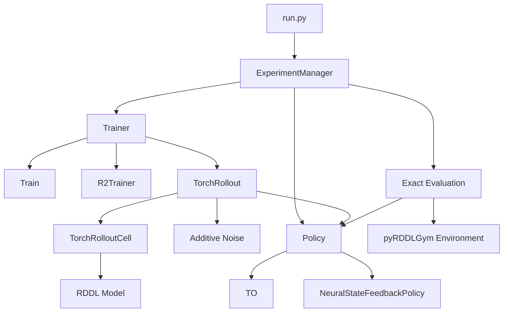

# System Overview

This file provides a high-level overview of the main components of the project and how they interact.

---

## Main Architecture



---

## Main Components

| Component | Role |
|---|---|
| `run.py` | Entry point of the program |
| `ExperimentManager` | Coordinates experiment setup, training, evaluation, and results |
| `Policy` | Determines which action should be executed |
| `NeuralStateFeedbackPolicy` | Generates actions from the current observation |
| `TO` | Selects trainable actions according to the timestep |
| `Train` | Performs standard differentiable policy training |
| `R2Trainer` | Performs training plus sensitivity analysis and sigma refresh |
| `TorchRollout` | Runs the policy over multiple timesteps |
| `Additive Noise` | Perturbs policy actions before model execution |
| `TorchRolloutCell` | Executes one differentiable simulation step according to the RDDL model |
| `RDDL Model` | Defines the system dynamics, rewards, and state transitions |
| `MBDPOPolicy.evaluate()` | Evaluates the current policy without training |
| `pyRDDLGym Environment` | Executes exact evaluation episodes |

---

## Main Training Paths

The project contains two main training paths.

### Standard Training

```text
Policy
→ TorchRollout
→ Additive Noise
→ RDDL Model
→ Return
→ Loss
→ Backpropagation
→ Policy Update
```

### R2 Training

```text
Update Rollout
→ Policy Update
→ Analysis Rollout
→ Action Sensitivity
→ Sigma Profile
→ Noise for Next Iteration
```

---

## Policy Options

```text
NeuralStateFeedbackPolicy:
Observation → Neural Network → Action

TO:
Timestep → Trainable Action → Action
```

---

## Noise Options

```text
NoAdditiveNoise
ConstantAdditiveNoise
LinearDecayAdditiveNoise
R2GradientAdditiveNoise
```

The standard noise classes use predefined or scheduled sigma values.

`R2GradientAdditiveNoise` calculates timestep-specific sigma values from action sensitivity.

---

## Documentation Map

- `00_system_overview.md` – high-level architecture
- `01_main_flow.md` – detailed runtime flow
- `02_class_diagram.md` – class relationships and inheritance
- `classes/` – detailed documentation for individual classes