# Main Flow

This file describes the main runtime flow of the project, from the entry point to training, evaluation, and result generation.

---

## 1. Main System Flow

The program starts in `run.py`.

`run.py` builds the experiment configuration and creates an `ExperimentManager`.

The manager then creates the policy and trainer, runs the training process, evaluates the policy when required, and stores the experiment results.

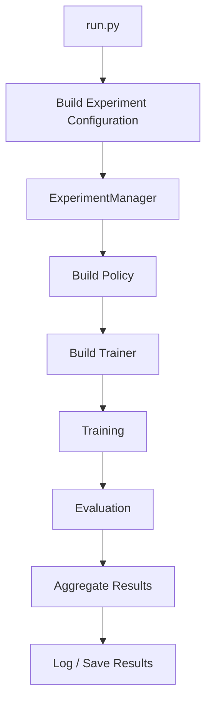

---

## 2. Policy Selection

`ExperimentManager` creates one of two policy types:

- `NeuralStateFeedbackPolicy`
- `TO`

The selected policy determines how an action is generated at each timestep.

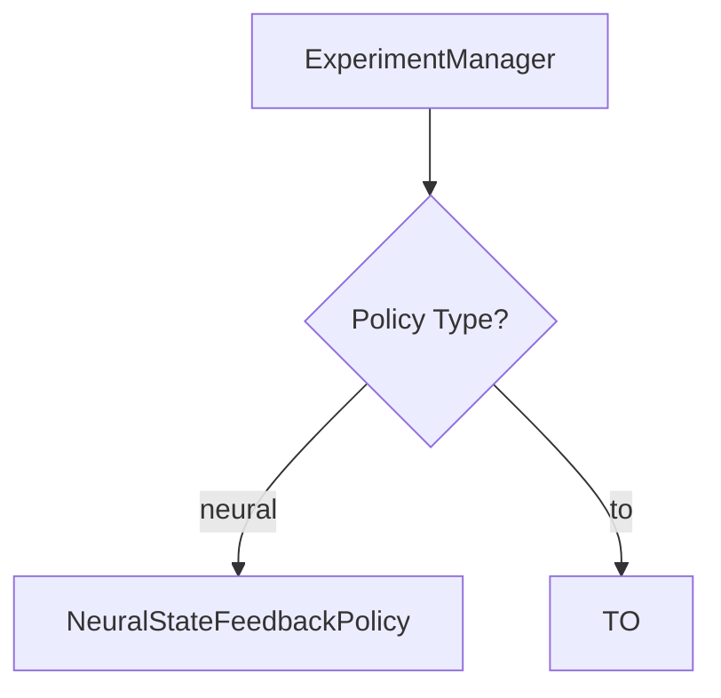
---

## 3. Trainer Selection

`ExperimentManager` selects the trainer according to the configured noise type.

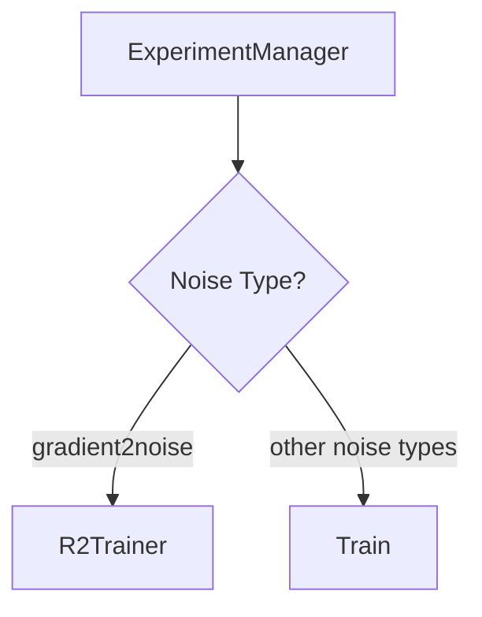

### Trainer Behavior

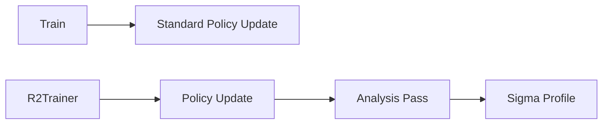

### Main Difference

- `Train` performs the standard differentiable policy-training process.
- `R2Trainer` is used for `gradient2noise` and adds an analysis phase that calculates a new sigma profile for future training iterations.

---

## 4. Standard Training Flow

The standard training path is used when the trainer is `Train`.

The policy is executed through a differentiable rollout, rewards are accumulated into a return, and the negative return is used as the loss for policy optimization.

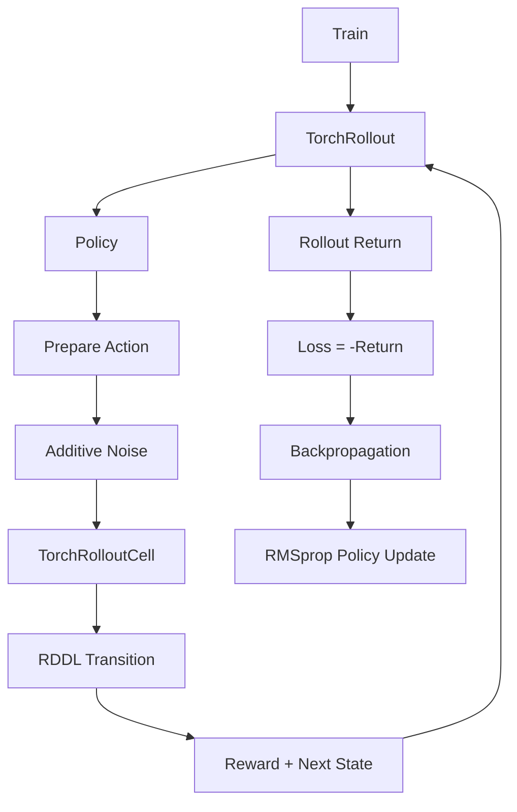

### One Rollout Timestep

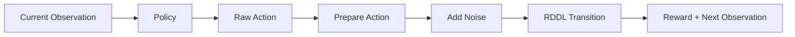

### Main Idea

- `Train` starts the optimization step.
- `TorchRollout` runs the policy over multiple timesteps.
- At each timestep, the policy creates an action.
- The action is prepared and optionally perturbed by additive noise.
- `TorchRolloutCell` executes one differentiable RDDL transition.
- Rewards from the rollout are combined into the return.
- The loss is the negative return.
- Backpropagation calculates gradients.
- RMSprop updates the policy parameters.

---

## 5. Noise Flow

The noise system receives a prepared policy action and optionally perturbs its floating-point values before the action enters the RDDL transition.

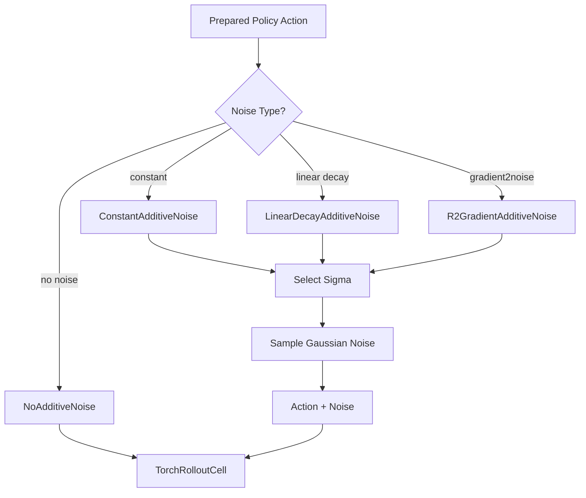

### How Sigma Is Chosen

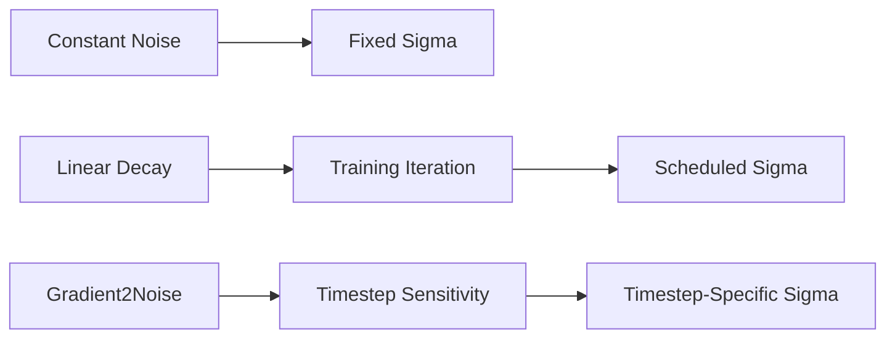

### Main Idea

For floating-point actions, the general form is:

`noisy_action = action + GaussianNoise * sigma`

The difference between the noise types is mainly how `sigma` is selected:

- `NoAdditiveNoise` uses zero noise.
- `ConstantAdditiveNoise` uses a fixed sigma.
- `LinearDecayAdditiveNoise` changes sigma according to the training iteration.
- `R2GradientAdditiveNoise` uses a sigma profile calculated from action sensitivity.

---

## 6. R2 Training Flow

The R2 training path is used when the noise type is `gradient2noise`.

Each iteration contains:
1. A policy update rollout.
2. A post-update analysis rollout.
3. A sigma-profile refresh.

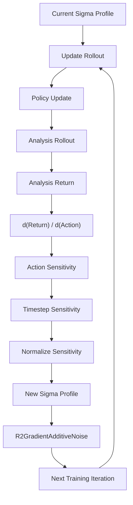

### Update Phase

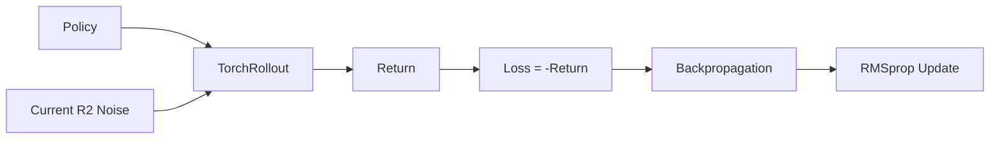

### Analysis Phase

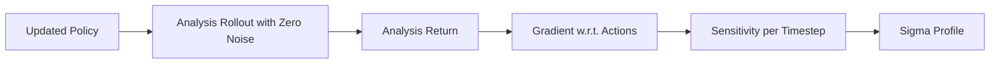

### Main Idea

The update phase changes the policy.

The analysis phase does not update the policy. It measures how sensitive the analysis return is to the actions executed at each timestep.

The resulting sensitivity values are converted into a sigma profile.

That sigma profile is used during the next update iteration.

---

## 7. Exact Evaluation Flow

Exact evaluation measures the current policy directly inside the pyRDDLGym environment.

No policy optimization is performed during this phase.

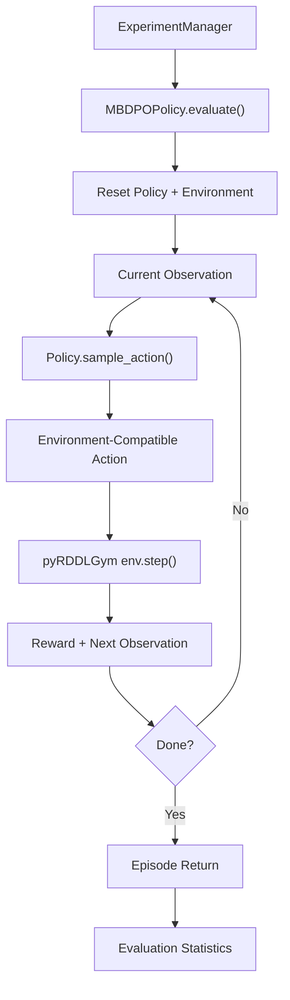

### Main Idea

During exact evaluation:

- The policy is not updated.
- Actions are selected without gradient-based training.
- The differentiable `TorchRollout` is not used.
- The policy interacts directly with the pyRDDLGym environment.
- Training additive noise is not applied.
- Rewards are accumulated into an evaluation return.
- Statistics such as mean and standard deviation are returned to `ExperimentManager`.