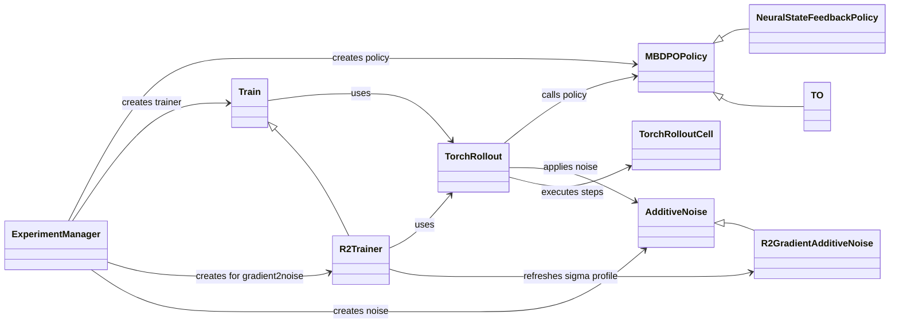

# Class Diagram

This file describes the main classes in the project and the relationships between them.

---

## 1. Class Responsibilities

| Class | Main Responsibility |
|---|---|
| `ExperimentManager` | Coordinates the experiment and creates the main components |
| `MBDPOPolicy` | Provides the common policy interface and evaluation behavior |
| `NeuralStateFeedbackPolicy` | Generates actions from the current observation using a neural network |
| `TO` | Stores and optimizes a fixed action sequence over the horizon |
| `Train` | Performs standard differentiable policy training |
| `R2Trainer` | Performs policy training plus sensitivity analysis and sigma refresh |
| `TorchRollout` | Executes the policy over multiple timesteps |
| `TorchRolloutCell` | Executes one differentiable RDDL transition |
| `AdditiveNoise` | Base interface for adding noise to actions |
| `NoAdditiveNoise` | Leaves actions numerically unchanged |
| `ConstantAdditiveNoise` | Adds Gaussian noise with a fixed sigma |
| `LinearDecayAdditiveNoise` | Changes sigma according to the training iteration |
| `R2GradientAdditiveNoise` | Builds and applies a timestep-specific sigma profile from action sensitivity |

---

## 2. Inheritance Structure

The following diagram shows which classes inherit behavior from other classes.

```mermaid
classDiagram
    direction TB

    class MBDPOPolicy
    class NeuralStateFeedbackPolicy
    class TO

    class Train
    class R2Trainer

    class AdditiveNoise
    class NoAdditiveNoise
    class ConstantAdditiveNoise
    class LinearDecayAdditiveNoise
    class R2GradientAdditiveNoise

    MBDPOPolicy <|-- NeuralStateFeedbackPolicy
    MBDPOPolicy <|-- TO

    Train <|-- R2Trainer

    AdditiveNoise <|-- NoAdditiveNoise
    AdditiveNoise <|-- ConstantAdditiveNoise <|-- LinearDecayAdditiveNoise
    AdditiveNoise <|-- R2GradientAdditiveNoise
```

### How to Read the Diagram

The arrow points toward the parent class.

For example:

`MBDPOPolicy <|-- NeuralStateFeedbackPolicy`

means:

`NeuralStateFeedbackPolicy` inherits from `MBDPOPolicy`.

---

## 3. Main Class Relationships

The following diagram shows the main runtime relationships between the important classes.



### Relationship Types

- `creates` – creates an instance of another class.
- `uses` – uses another class during execution.
- `calls policy` – asks the policy to generate an action.
- `applies noise` – applies noise to the generated action.
- `executes steps` – performs RDDL transitions through `TorchRolloutCell`.
- `refreshes sigma profile` – updates the R2 noise profile after analysis.